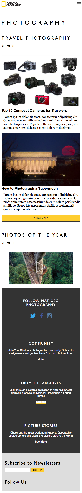
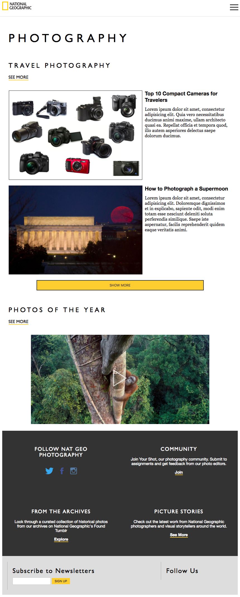

# Responsive Design + SCSS - National Geographic

## Context
National Geographic originated as a popular print magazine that reports on interesting topics, discoveries, and developments in anthropology and nature. It now provides most of its content online and is looking for a front-end developer to build a responsive front-end for their *Photography* section. The designer has created mock ups of the mobile, tablet, and desktop prototypes.

---

## Objectives
- Create a mobile-first layout with elements whose styles change on the page based on the width of the viewport.
- Incorporate SCSS into your styles workflow

### Learning Objectives
After completing this assignment you should be able to
- Use SCSS to make CSS coding quicker and easier
- Use media queries to elements on the page based on the width of the viewport
- Improve your attention to detail by implementing appropriate margin, padding, font-sizes, and column layouts based on a designer's specification

### Performance Objectives
- Responsive first design. (Create your base styles and use `min-width` in your media queries to modify elements that change on wider viewports)
- You should make use of SCSS:
  + variables
  + mixins


### Deliverables
- an `index.html` file with the content
- a `main.scss` file in a `scss` directory with your styles that compiles to a `style.css` file inside a `css` directory
- a site that replicates the styles as shown below
- a site that uses CSS media queries and displays responsively as shown below
- a public Github repository


---

## Mockups

### Mobile
*( < 768px )*



### Tablet
*( 768px - 1023px )*


### Desktop
*( > 1024px )*


---

## Additional Instructions

#### Setup
1. Use the `gen-scss-project` script to create the files and folders for the project.
  ```bash
  cd ~/muktek/labs
  gen-scss-project responsive-design-natgeo
  ```
2. `cd` into `responsive-design-natgeo`
3. Use the `watch-scss` command in the project's root directory to compile the scss to 'watch' for changes in your `.scss` files and update your `style.css` file.

#### Designer notes
- the title fonts are _'Gill Sans'_, _'Century Gothic'_, _sans-serif_.
- the fancy header font stack are  _'Georgia'_, _'Palatino'_, _serif_.
- yellow color is `#fecd2f`
- dark grey color is `#333333`
- light grey color is `#aaaaaa`


#### Make sure you include fontawesome in your `<head/>` *before* your `style.css` file
```html
<head>
      ...<!--  your title, meta tags etc. -->
      <link rel="stylesheet" href="https://cdnjs.cloudflare.com/ajax/libs/font-awesome/4.6.3/css/font-awesome.min.css">
      <link rel="stylesheet" href="./css/styles.css">
</head>
```
